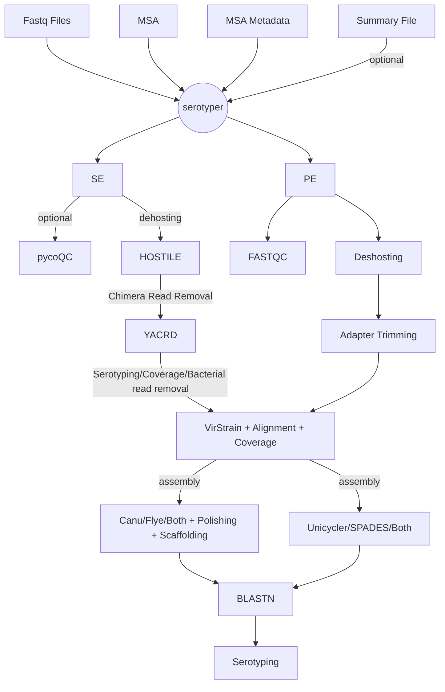

# serotyper
Pipeline for Viral Serotyping

```
bowtie2-build --threads 20 Bos_taurus.ARS-UCD1.3.dna.toplevel.fa  Bos_taurus.ARS-UCD1.3.dna.toplevel.fa
nextflow run main.nf --input "data/illuminape/SRR27845*_{1,2}.fastq.gz" --skipTrim true --hostile_ext="--index /data/serot
yper/resources/index/Bos_taurus.ARS-UCD1.3.dna.toplevel.fa" -resume
```



