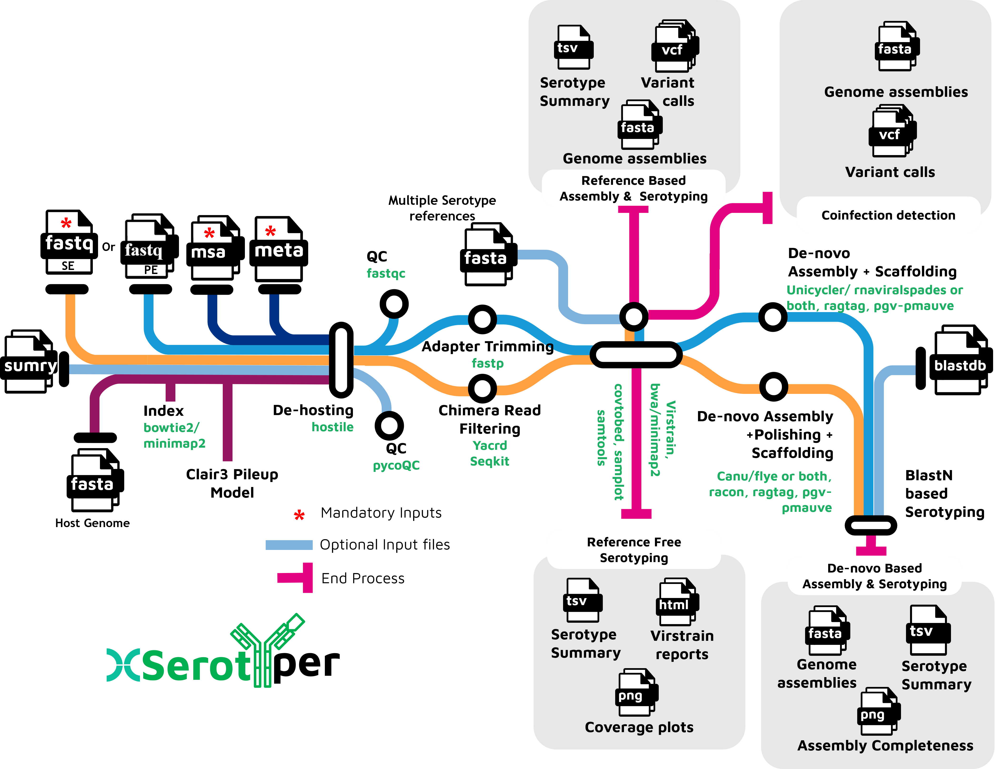

<p align="center">
  
</p>

# SeroTyper v0.3

**SeroTyper** is a Nextflow DSL2 workflow for identifying viral serotypes from either:

> Note: This pipeline is still under development. This is the first stable release; however, minor issues need to be addressed.

- Illumina paired-end reads (`--mode PE`), or
- Oxford Nanopore Technologies (ONT) single-end reads (`--mode SE`).

The workflow combines rapid, assembly-free serotyping with read-to-reference validation and optional genome reconstruction. Depending on the selected options, it can perform read quality control, host-read removal, adapter or chimera cleanup, VirStrain-based serotyping, serotype-specific read extraction, de novo assembly, reference-based consensus generation, BLAST confirmation, and screening for possible coinfections.

<p align="center">
  
</p>

> **Version documented:** 0.3  
> **Workflow language:** Nextflow DSL2  
> **Primary use case:** viral serotyping from short- or long-read sequencing data

---

## Table of contents

- [Pipeline overview](#pipeline-overview)
- [Analysis paths](#analysis-paths)
- [Requirements](#requirements)
- [Installation](#installation)
- [Databases and reference files](#databases-and-reference-files)
- [Input data](#input-data)
- [Quick start](#quick-start)
- [Parameters](#parameters)
- [Detailed workflow](#detailed-workflow)
- [Output structure](#output-structure)
- [Interpreting key reports](#interpreting-key-reports)
- [Execution reports and reproducibility](#execution-reports-and-reproducibility)
- [Resource management](#resource-management)
- [Resume and rerun behavior](#resume-and-rerun-behavior)
- [Troubleshooting](#troubleshooting)
- [Known implementation notes](#known-implementation-notes)
- [Repository structure](#repository-structure)
- [Citation and acknowledgements](#citation-and-acknowledgements)

---

## Pipeline overview

At a high level, SeroTyper performs the following operations:

1. Reads paired-end Illumina or single-end ONT FASTQ files.
2. Runs platform-appropriate initial quality control.
3. Optionally removes reads assigned to a host genome.
4. Cleans reads:
   - Illumina: `fastp` adapter and quality trimming.
   - ONT: `yacrd` chimera scrubbing.
5. Calls the most likely viral strain/serotype with VirStrain.
6. Extracts reads mapping to the VirStrain best match and calculates reference coverage.
7. Produces a cohort-level VirStrain serotype summary.
8. Optionally runs de novo assembly:
   - Illumina: Unicycler and/or RNA-Viral-SPAdes.
   - ONT: Canu and/or Flye.
9. Optionally confirms assembled sequences with BLASTN.
10. For ONT data, optionally selects the best reference, calls variants with Clair3, and builds a masked consensus sequence.
11. Optionally screens for coinfection by mapping reads against a combined set of reference contigs and creating per-contig consensuses.
12. Writes Nextflow execution reports and a consolidated software-version report.

The workflow is designed for clinical or surveillance datasets in which some samples may have insufficient viral depth. Process failures are therefore configured to be ignored so that other samples can continue.

---

## Analysis paths

### Illumina paired-end path

```text
Paired FASTQ
  └─ FastQC + MultiQC
      └─ Hostile dehosting (optional)
          └─ fastp trimming (optional)
              └─ VirStrain serotyping
                  ├─ best-reference alignment and viral-read extraction
                  ├─ cohort serotype summary
                  ├─ de novo assembly (optional)
                  │   ├─ Unicycler
                  │   └─ RNA-Viral-SPAdes
                  ├─ assembly BLASTN confirmation (optional)
                  └─ coinfection analysis (optional)
```

### ONT single-end path

```text
ONT FASTQ
  ├─ pycoQC, when a sequencing-summary file is supplied
  └─ Hostile dehosting (optional)
      └─ YACRD chimera scrubbing (optional)
          └─ VirStrain serotyping
              ├─ best-reference alignment and viral-read extraction
              ├─ cohort serotype summary
              ├─ de novo assembly (optional)
              │   ├─ Canu
              │   └─ Flye
              ├─ assembly BLASTN confirmation (optional)
              ├─ reference selection and read-count summary (optional)
              │   └─ primer trimming (optional)
              │       └─ Clair3 variant calling
              │           └─ masked consensus sequence
              └─ coinfection analysis (optional)
```

---

## Requirements

SeroTyper is intended for Linux and requires:

- Nextflow 24.x or a compatible release
- Java 17 or a Nextflow-compatible Java runtime
- Conda, Mamba, or Micromamba when using the included Conda environment/profile
- Sufficient disk space for FASTQ, BAM, assembly, and Nextflow work files
- A VirStrain database and aligned reference set
- A metadata table mapping reference accessions to serotypes
- Additional reference files for optional reference-based assembly, coinfection analysis, and BLAST

GPU acceleration may be beneficial for Clair3, depending on the installed TensorFlow/CUDA environment, but the process is parameterized by CPU threads and can be configured for the available system.

---

## Installation

### 1. Install Conda and Mamba

Install Miniconda or an equivalent Conda distribution, then install Mamba in the base environment:

```bash
conda install -n base -c conda-forge mamba
```

### 2. Obtain SeroTyper

```bash
git clone https://github.com/Rohit-Satyam/serotyper.git
cd serotyper
```

For a downloaded release archive:

```bash
unzip serotyper-0.3.zip
cd serotyper-0.3
```

### 3. Create the environment

```bash
mamba env create -f environment.yml
conda activate serotyper
```

The supplied environment is comprehensive and includes Nextflow and the principal bioinformatics programs used by the workflow. Because the exported environment contains platform-specific and tightly pinned packages, dependency resolution may be slow or may fail on a different platform. In that case, use the Nextflow Conda profile so process-specific environments can be resolved from the `conda` directives where provided:

```bash
nextflow run main.nf -profile conda \
  --input 'data/*_{1,2}.fastq.gz' \
  --mode PE \
  --genomesize 11000 \
  --assembler unicycler \
  --db /absolute/path/to/virstrain_db \
  --mafftMeta /absolute/path/to/metadata.tsv \
  --outdir results
```

> Some modules rely on executables available in the activated global environment rather than defining their own process-level Conda environment. Activating the supplied `serotyper` environment remains the most complete execution method for v0.3.

### 4. Verify the installation

```bash
nextflow -version
virstrain -h
fastqc --version
fastp --version
samtools --version
```

For ONT reference-based assembly, also verify:

```bash
run_clair3.sh --help
mm2plus --version
bcftools --version
```

---

## Databases and reference files

### VirStrain database (`--db`)

A VirStrain database is mandatory. The workflow passes this path to VirStrain and also expects an aligned FASTA-like file matching:

```text
<db>/*.aln
```

The directory should therefore contain both the VirStrain database files and the multiple-sequence alignment used to recover the best matching reference sequence.

Prebuilt Dengue virus and Foot-and-Mouth Disease virus resources were referenced by the original project documentation at Zenodo record `13235270`. Verify the contents and compatibility of any downloaded resource with the current pipeline version.

To build a VirStrain database for another virus, follow the VirStrain database-building documentation. A typical command is conceptually similar to:

```bash
virstrain_build -i mafft.aln -d output_database -s 0.6
```

### Metadata file (`--mafftMeta`)

This tab-delimited file links sequence identifiers used in the alignment/database to serotype information.

Minimum expected structure:

```text
accession	serotype
REFERENCE_001	DENV-1
REFERENCE_002	DENV-2
```

Requirements:

- The first column must contain reference identifiers matching headers in the aligned references and BLAST database.
- The file must have a header.
- The second column should contain the serotype.
- Additional metadata columns are allowed and are appended to several reports.
- Use tabs, not commas, unless you have verified that downstream shell parsing behaves as expected.

### Reference directory (`--referenceDir`)

This input is required when either reference-based assembly or coinfection analysis is enabled.

For reference-based assembly, it may be:

- a directory containing `.fa`, `.fasta`, or `.fas` files, or
- a single FASTA file.

For the coinfection branch, the current workflow explicitly searches for:

```text
<referenceDir>/*.fasta
```

Therefore, when coinfection analysis is enabled, store each candidate reference in a file ending in `.fasta`.

Recommended layout:

```text
references/
├── DENV1.fasta
├── DENV2.fasta
├── DENV3.fasta
└── DENV4.fasta
```

Use short, shell-safe FASTA identifiers without spaces or punctuation that could interfere with filenames.

### BLAST database (`--blastdb`)

Required only when `--skipBlast false`.

Create a nucleotide database from the reference sequences:

```bash
makeblastdb \
  -in combined_references.fasta \
  -dbtype nucl \
  -out denv_blastn_db \
  -title 'DENV database'
```

Pass the database prefix, not an individual `.nin`, `.nsq`, or `.nhr` file:

```bash
--blastdb /absolute/path/to/denv_blastn_db
```

### Clair3 model (`--clair3model`)

Required for ONT reference-based consensus generation and for the coinfection consensus branch. The model must match the sequencing chemistry, flow cell, basecaller, and basecalling model as closely as possible.

Example:

```bash
--clair3model /absolute/path/to/r1041_e82_400bps_sup_v430
```

### Primer file (`--primerfile`)

Used when ONT primer trimming is enabled. The included project resource is:

```text
resources/DENV_multiplex_primer_sets_v1.xlsx
```

The `ALIGNTRIM` process converts the spreadsheet with `xlsx2csv`, filters rows for the selected reference, and supplies the resulting primer coordinates to `align_trim`.

### Host indexes (`--hostile_ext`)

The default Hostile index is a human-oriented bundled index:

```text
--index human-t2t-hla.rs-viral-202401_ml-phage-202401
```

For a non-human host, provide a suitable Hostile-compatible index through `--hostile_ext`.

Example:

```bash
--hostile_ext '--index /absolute/path/to/bovine_host_index'
```

For amplicon or SISPA datasets, consider whether dehosting is biologically appropriate; host removal may discard reads with partial similarity to host sequences.

---

## Input data

### Illumina paired-end data

Use `--mode PE`. Input files are paired with `Channel.fromFilePairs`, so the filename pattern must identify the R1/R2 pair.

Recommended naming:

```text
sampleA_R1.fastq.gz
sampleA_R2.fastq.gz
sampleB_R1.fastq.gz
sampleB_R2.fastq.gz
```

Example patterns:

```bash
--input 'data/*_R{1,2}.fastq.gz'
```

or:

```bash
--input 'data/*_{1,2}.fastq.gz'
```

Quote glob patterns so the shell does not expand them before Nextflow receives them.

### ONT single-end data

Use `--mode SE`. Each FASTQ file is treated as one sample, and its `simpleName` becomes the sample identifier.

```text
data/
├── sampleA.fastq.gz
└── sampleB.fastq.gz
```

Example:

```bash
--input 'data/*.fastq.gz'
```

Avoid duplicate basenames in different directories because outputs are named by sample identifier.

### Sample identifiers

Sample IDs are propagated into report, BAM, FASTA, VCF, log, plot, and directory names. Use names containing letters, numbers, underscores, and hyphens. Avoid whitespace and shell metacharacters.

---

## Quick start

### Display command-line help

```bash
nextflow run main.nf --help
```

### Minimal Illumina paired-end serotyping

This performs raw-read QC, dehosting, `fastp` trimming, VirStrain calling, and best-hit alignment. It skips de novo assembly, BLAST, reference consensus, and coinfection analysis.

```bash
nextflow run main.nf -profile conda \
  --input 'data/illumina/*_R{1,2}.fastq.gz' \
  --mode PE \
  --genomesize 11000 \
  --assembler unicycler \
  --db /absolute/path/to/virstrain_db \
  --mafftMeta /absolute/path/to/metadata.tsv \
  --outdir results_illumina \
  --skipDenovoAssembly true \
  --skipReferenceAssembly true \
  --skipBlast true \
  --skipCoinfection true
```

### Illumina serotyping with both assemblers and BLAST confirmation

```bash
nextflow run main.nf -profile conda \
  --input 'data/illumina/*_R{1,2}.fastq.gz' \
  --mode PE \
  --genomesize 11000 \
  --assembler all \
  --db /absolute/path/to/virstrain_db \
  --mafftMeta /absolute/path/to/metadata.tsv \
  --blastdb /absolute/path/to/virus_blast_db \
  --outdir results_illumina \
  --skipDenovoAssembly false \
  --skipBlast false \
  --skipReferenceAssembly true \
  --skipCoinfection true
```

### Minimal ONT serotyping

```bash
nextflow run main.nf -profile conda \
  --input 'data/ont/*.fastq.gz' \
  --mode SE \
  --genomesize 11000 \
  --assembler flye \
  --db /absolute/path/to/virstrain_db \
  --mafftMeta /absolute/path/to/metadata.tsv \
  --outdir results_ont \
  --skipDenovoAssembly true \
  --skipReferenceAssembly true \
  --skipBlast true \
  --skipCoinfection true
```

### ONT serotyping and reference-based consensus

```bash
nextflow run main.nf -profile conda \
  --input 'data/ont/*.fastq.gz' \
  --mode SE \
  --genomesize 11000 \
  --assembler flye \
  --db /absolute/path/to/virstrain_db \
  --mafftMeta /absolute/path/to/metadata.tsv \
  --referenceDir /absolute/path/to/references \
  --clair3model /absolute/path/to/clair3_model \
  --primerfile /absolute/path/to/primers.xlsx \
  --outdir results_ont \
  --skipReferenceAssembly false \
  --skipPrimertrim false \
  --skipDenovoAssembly true \
  --skipBlast true \
  --skipCoinfection true
```

### ONT de novo assembly with Canu and Flye

```bash
nextflow run main.nf -profile conda \
  --input 'data/ont/*.fastq.gz' \
  --mode SE \
  --genomesize 11000 \
  --assembler all \
  --db /absolute/path/to/virstrain_db \
  --mafftMeta /absolute/path/to/metadata.tsv \
  --outdir results_ont_assembly \
  --skipDenovoAssembly false \
  --skipReferenceAssembly true \
  --skipBlast true \
  --skipCoinfection true
```

### Coinfection screening

```bash
nextflow run main.nf -profile conda \
  --input 'data/ont/*.fastq.gz' \
  --mode SE \
  --genomesize 11000 \
  --assembler flye \
  --db /absolute/path/to/virstrain_db \
  --mafftMeta /absolute/path/to/metadata.tsv \
  --referenceDir /absolute/path/to/references \
  --clair3model /absolute/path/to/clair3_model \
  --outdir results_coinfection \
  --skipReferenceAssembly true \
  --skipCoinfection false \
  --coverageCoinfection 20 \
  --meandepth 5 \
  --min_reads_coinf 200
```

### Non-human host removal

```bash
nextflow run main.nf -profile conda \
  --input 'data/fmdv/*_R{1,2}.fastq.gz' \
  --mode PE \
  --genomesize 8500 \
  --assembler unicycler \
  --db /absolute/path/to/fmdv_virstrain_db \
  --mafftMeta /absolute/path/to/fmdv_metadata.tsv \
  --hostile_ext '--index /absolute/path/to/bovine_host_index' \
  --outdir results_fmdv \
  --skipReferenceAssembly true \
  --skipCoinfection true
```

---

## Parameters

Boolean parameters should be passed explicitly as `true` or `false`.

### Core input and output

| Parameter | Description | Default in `nextflow.config` |
|---|---|---|
| `--input` | Quoted FASTQ glob. Paired files for PE; individual files for SE. Treated as required by the workflow. | Site-specific path |
| `--outdir` | Output directory. | Site-specific path |
| `--mode` | Sequencing mode: `PE` or `SE`. | `SE` |
| `--genomesize` | Approximate viral genome size in bases; used by assemblers. | `10000` |
| `--assembler` | PE: `unicycler`, `spades`, or `all`. SE: `canu`, `flye`, or `all`. | `canu` |

### Databases and references

| Parameter | Description | Required when |
|---|---|---|
| `--db` | VirStrain database directory/path. | Always |
| `--mafftMeta` | Tab-delimited accession-to-serotype metadata. | Always |
| `--referenceDir` | Reference FASTA file or directory; coinfection expects `*.fasta`. | Reference assembly or coinfection enabled |
| `--blastdb` | BLAST nucleotide database prefix. | `--skipBlast false` |
| `--clair3model` | Clair3 pretrained model directory. | Clair3-based consensus branches |
| `--primerfile` | Primer spreadsheet for ONT primer trimming. | Primer trimming enabled |
| `--summaryFile` | ONT sequencing summary for pycoQC. | Optional |

### Workflow switches

| Parameter | Effect | Default |
|---|---|---:|
| `--skipDehost` | Skip Hostile host-read removal. | `false` |
| `--skipTrim` | Skip `fastp` trimming. Used by the PE orchestration. | `false` |
| `--skipScrubbing` | Skip YACRD chimera scrubbing for SE reads. | `false` |
| `--skipDenovoAssembly` | Skip de novo assembly. | `true` |
| `--skipReferenceAssembly` | Skip the ONT reference-based consensus branch. | `false` |
| `--skipPrimertrim` | Skip primer trimming before Clair3. | `false` |
| `--skipBlast` | Skip BLASTN confirmation of de novo assemblies. | `true` |
| `--skipCoinfection` | Skip coinfection analysis. | `false` |
| `--skipAlignment` | Retained for compatibility but not used by the current orchestration. | `false` |

> Defaults enable reference assembly and coinfection while requiring their reference resources. For a simple serotyping-only run, explicitly set `--skipReferenceAssembly true --skipCoinfection true`.

### Coinfection thresholds

| Parameter | Description | Default |
|---|---|---:|
| `--coverageCoinfection` | Minimum percentage of a reference contig covered for selection. | `20` |
| `--meandepth` | Minimum mean depth for a candidate contig. | `5` |
| `--min_reads_coinf` | Minimum mapped-read count for a candidate contig. | `200` |

A candidate reference must satisfy the implemented contig-selection conditions to proceed to per-contig remapping and consensus generation.

### Compute parameters

| Parameter | Description | Default |
|---|---|---:|
| `--cpus` | Threads assigned to most processes. | `20` |
| `--jobs` | Documented maximum parallel jobs/samples. The current workflow does not directly use this parameter to set executor queue size. | `2` |

Use Nextflow executor settings, `queueSize`, or process selectors in a custom config to control actual task concurrency.

### Tool-specific extension parameters

These strings are appended directly to tool commands.

| Parameter | Tool / purpose | Default |
|---|---|---|
| `--fastp_ext` | Extra `fastp` options. | Adapter detection, Q30, minimum length 75, correction, adapter FASTA |
| `--fastqc_ext` | Extra FastQC options. | `--quiet` |
| `--hostile_ext` | Hostile index and options. | Human T2T/HLA/viral/phage index |
| `--spades_ext` | RNA-Viral-SPAdes options. | Empty |
| `--minimap_ext` | Minimap2/mm2plus preset. | `map-ont` |
| `--flye_ext` | Flye read mode/options. | `--nano-hq` |
| `--scrubb_ext` | All-vs-all mapper arguments before YACRD. | `-x ava-ont -g 500` |
| `--yacrd_ext` | YACRD scrubbing parameters. | `-c 4 -n 0.4` |
| `--canu_ext` | Canu input technology flag. | `-nanopore` |
| `--aligntrim_ext` | `align_trim` options. | `-m 10 --verbose` |
| `--clair3_ext` | Clair3 platform, ploidy, phasing, indel, and calling options. | ONT haploid-focused settings |
| `--cov` | Depth cutoff used to create low-coverage BED regions for reference consensus. | `20` |
| `--chimeric_ext` | Mentioned in help text but not used in the current workflow. | Not operational |

---

## Detailed workflow

### 1. Input channel creation

For `PE`, Nextflow groups read pairs with `Channel.fromFilePairs`. The channel contract is:

```text
(sample_id, [R1.fastq.gz, R2.fastq.gz])
```

For `SE`, every matched file becomes:

```text
(sample_id, reads.fastq.gz)
```

### 2. Initial quality control

#### Paired-end

`FASTQC` runs on raw reads, and `MULTIQC` aggregates the reports into the `01_rawFastQC` directory.

#### ONT

When `--summaryFile` is non-empty, `PYCOQC` generates a long-read QC report. Raw ONT FASTQ files are not passed through FastQC by the current main workflow.

### 3. Host-read removal

Unless `--skipDehost true`, `HOSTILE` removes host-associated reads. It runs in paired mode for `PE` and single-end mode for `SE` and publishes cleaned FASTQ files and a per-sample log.

### 4. Read cleanup

#### Illumina

Unless trimming is skipped, `FASTP` performs adapter trimming, quality filtering, correction, and minimum-length filtering. It writes JSON and HTML reports and a text file containing raw and retained read counts.

#### ONT

Unless scrubbing is skipped, reads are self-mapped with `mm2plus`; YACRD identifies and removes chimeric regions. Reads shorter than 100 bases are removed with SeqKit.

### 5. VirStrain serotyping

`VIRSTRAIN_CALL` invokes VirStrain against the supplied database.

For PE data it passes R1 and R2; for SE data it passes the single FASTQ. Outputs may include:

- VirStrain text report
- VirStrain HTML report
- depth CSV files

`VIRSTRAIN_ALIGN_BESTMATCH` then:

1. extracts the best VirStrain cluster/reference from the aligned reference collection;
2. aligns reads to the selected reference with BWA-MEM2 for PE or mm2plus for SE;
3. retains mapped reads;
4. writes a sorted and indexed BAM;
5. creates a Samplot coverage image;
6. calculates the proportion of reference bases covered at `>=20×`;
7. associates the selected reference with metadata from `--mafftMeta`.

### 6. Cohort serotype summary

`COMBINESEROTYPESUMMARY` concatenates per-sample results into:

```text
04_serotype/all_samples_summary_virstrain.tsv
```

The report includes the sample name, reference length, horizontal coverage at 20×, covered bases, and metadata columns.

### 7. De novo assembly

Assembly uses only reads retained after alignment to the VirStrain best match, combined with the chosen reference sequence for ordering/scaffolding.

#### Unicycler

Available for `PE`. Produces a raw assembly, reference-guided RagTag scaffold, assembly graph/log files, and comparative visualization outputs.

#### RNA-Viral-SPAdes

Available for `PE`. Produces SPAdes scaffolds, RagTag scaffolds, graph/log files, and comparative visualization outputs.

#### Canu

Available for `SE`. Uses the approximate genome size and ONT input mode, then polishes/orders the assembly using the module’s downstream commands.

#### Flye

Available for `SE`. Uses the selected Flye read mode, then performs downstream polishing/scaffolding and visualization.

Choose `--assembler all` to run both compatible assemblers for the selected sequencing mode.

### 8. Coinfection analysis

Unless skipped, the workflow concatenates all `*.fasta` references in `--referenceDir`, maps each sample against the combined references, and calculates per-contig support.

Candidate contigs are selected using:

- percent coverage (`--coverageCoinfection`),
- mean depth (`--meandepth`), and
- mapped reads (`--min_reads_coinf`).

Selected contigs are then:

1. extracted from the combined reference;
2. remapped independently;
3. processed with Clair3;
4. converted to a masked per-contig consensus FASTA.

Samples without selected contigs are intentionally dropped from downstream coinfection steps.

### 9. ONT reference-based assembly

This branch runs only when `--mode SE` and reference assembly is enabled.

`ALIGNTOREFERENCE` maps each sample against every candidate reference and records mapped-read counts. The reference with the highest number of mapped primary reads is selected. The process also:

- copies the best reference;
- preserves the best BAM and index;
- creates a low-coverage BED file using `--cov`;
- writes an alignment summary and basic SeqKit read statistics.

The cohort report is written to:

```text
06_referenceAssembly/all_samples_summary_referencebased.tsv
```

The VirStrain and reference-selection reports are joined into:

```text
Serotyper_report.tsv
```

#### Optional primer trimming

When enabled, the selected primer set is extracted from the XLSX file and `align_trim` trims primer-aligned regions from the BAM. A new low-coverage BED is calculated from the primer-trimmed alignment.

#### Clair3 and consensus construction

Clair3 calls variants from the selected/trimmed BAM. Variants are sorted, filtered, normalized, atomized, deduplicated, compressed, and indexed. `bcftools consensus` applies PASS variants to the reference and masks low-coverage intervals to generate:

```text
<sample>.fasta
```

### 10. BLASTN assembly confirmation

When both de novo assembly and BLAST are enabled, each reference-scaffolded assembly is queried against `--blastdb`.

The BLAST output contains:

```text
qseqid  sseqid  pident  length  evalue  bitscore  qcovs
```

Metadata matching the subject ID is appended from `--mafftMeta`. A reduced cohort summary is written in the relevant assembler-specific BLAST directory.

### 11. Software versions

Modules that emit `versions.yml` are collected by `SOFTWARE_VERSIONS_HTML`, which creates:

- `software_versions.tsv`
- `software_versions.html`
- a versions record for the aggregation process itself

---

## Output structure

The exact tree depends on enabled branches.

```text
<outdir>/
├── 01_rawFastQC/                         # PE raw FastQC and MultiQC
├── 01_longReadQC/                        # pycoQC report, when supplied
├── 02_dehosting/                         # Hostile clean reads and logs
├── 03_adapterTrimming/                   # fastp outputs for PE
├── 03_chimericReadRemoval/               # YACRD outputs for SE
├── 04_serotype/                          # VirStrain and best-hit alignment outputs
│   ├── <sample>.VirStrain_report.txt
│   ├── <sample>.VirStrain_report.html
│   ├── <sample>.serotype.txt
│   ├── <sample>.bam
│   ├── <sample>.bam.bai
│   ├── <sample>.<reference>.fasta
│   ├── <sample>.<reference>.png
│   └── all_samples_summary_virstrain.tsv
├── 05_UnicyclerAssembly/                 # PE Unicycler products
├── 05_rnaviralSpadesAssembly/            # PE RNA-Viral-SPAdes products
├── 05_CanuAssembly/                      # ONT Canu products
├── 05_FlyeAssembly/                      # ONT Flye products
├── 06_assemblyBLASTunicycler/            # Optional assembly BLAST summaries
├── 06_assemblyBLASTspades/
├── 06_assemblyBLASTcanu/
├── 06_assemblyBLASTflye/
├── 06_referenceAssembly/                 # ONT best-reference and consensus outputs
│   ├── <sample>_alignment_results.tsv
│   ├── all_samples_summary_referencebased.tsv
│   ├── <sample>.normalized.clair3.vcf.gz
│   ├── <sample>.fasta
│   ├── <sample>.clair3.log
│   └── primerTrimmed_bams/
├── coinfection/
│   ├── 01_contig_selection/
│   ├── 02_remap_per_contig/
│   ├── 03_clair3/
│   └── 04_consensus/
├── Serotyper_report.tsv                  # Combined VirStrain/reference report
├── software_versions.tsv
├── software_versions.html
├── timeline.html
├── report.html
├── execution_trace.txt
└── pipeline_dag.html
```

Nextflow also creates a `work/` directory in the launch directory. Do not delete it until the run is complete and you no longer need `-resume`.

---

## Interpreting key reports

### `all_samples_summary_virstrain.tsv`

Expected leading columns:

| Column | Meaning |
|---|---|
| `SampleName` | Sample identifier derived from filenames |
| `Reference_Genome_Length` | Length of the VirStrain-selected reference |
| `Horizontal_coverage_(>=20X)` | Percentage of reference bases with depth at least 20 |
| `Base_Sequenced` | Number of reference bases meeting the 20× threshold |
| Metadata columns | Values retrieved from `--mafftMeta`, including serotype |

A serotype assignment with low horizontal coverage should be treated cautiously and reviewed alongside mapped-read counts, BAM coverage, the VirStrain report, and any reference-based or BLAST result.

### `all_samples_summary_referencebased.tsv`

Contains mapped-read counts for each supplied reference, the most-mapped reference, and SeqKit-derived read statistics. It is generated only for the ONT reference-based branch.

### `Serotyper_report.tsv`

A full outer join of the VirStrain cohort summary and the reference-based alignment summary on the first column, normally the sample identifier. Empty fields indicate that one analysis branch did not produce a result for that sample.

### Assembly BLAST summaries

These are useful as an independent check of the assembled/scaffolded sequence’s closest database match. Review percent identity, query coverage, alignment length, and the metadata attached to the top hit rather than relying only on the reported label.

### Coinfection outputs

A per-contig consensus indicates that a reference contig passed the configured coverage/depth/read thresholds and proceeded through variant calling. It is evidence supporting a candidate mixed infection, not by itself a definitive biological diagnosis. Examine mapping specificity, cross-mapping among related serotypes, depth uniformity, contamination controls, and lineage divergence.

---

## Execution reports and reproducibility

The workflow automatically writes:

- `timeline.html` — task timing and resource-use timeline
- `report.html` — Nextflow execution report
- `execution_trace.txt` — per-task trace table
- `pipeline_dag.html` — rendered process graph
- `software_versions.html` and `.tsv` — collected tool versions

For reproducible analyses:

1. Record the SeroTyper release or Git commit.
2. Preserve the full Nextflow command.
3. Archive `nextflow.config` and any custom config.
4. Record database/reference checksums and release dates.
5. Keep the metadata table used for the run.
6. Retain the software-version report.
7. Keep the Nextflow log (`.nextflow.log`) and execution reports.

A run manifest can be captured with:

```bash
nextflow run main.nf ... 2>&1 | tee serotyper.run.log
```

---

## Resource management

The global configuration assigns most tasks:

```text
cpus   = params.cpus
memory = 20 GB
```

Default `--cpus` is 20. Adjust it to the available machine:

```bash
--cpus 8
```

Some assembly and variant-calling steps may need more memory than lightweight QC or summary steps. You can override resources with a custom Nextflow config:

```groovy
process {
  withName: 'CANU|FLYE|RNAVIRALSPADES|UNICYCLER' {
    cpus = 16
    memory = '64 GB'
  }

  withName: 'CLAIR3|RUN_CLAIR3_PER_CONTIG' {
    cpus = 12
    memory = '48 GB'
  }
}
```

Run with:

```bash
nextflow run main.nf -c resources.config ...
```

The documented `--jobs` parameter does not currently impose a task-concurrency limit. Configure the executor or `executor.queueSize` in Nextflow when concurrency must be capped.

---

## Resume and rerun behavior

Use `-resume` to reuse successful cached tasks after changing downstream options or recovering from an interrupted run:

```bash
nextflow run main.nf -resume \
  --input 'data/*.fastq.gz' \
  ...
```

Nextflow caching depends on inputs, command scripts, parameters, code, and file metadata. Changes to database files, metadata, references, or extension parameters may invalidate tasks.

To inspect failures:

```bash
grep -n 'ERROR\|WARN' .nextflow.log
```

To remove work files after results have been validated:

```bash
nextflow clean -f
```

This removes cached work and prevents future resume from those tasks.

---

## Troubleshooting

### The workflow reports a missing required parameter

Always pass explicit paths for:

```text
--input
--db
--mafftMeta
--outdir
```

Also pass `--referenceDir` when reference assembly or coinfection is enabled and `--blastdb` when BLAST is enabled.

### An assembler is rejected

Assembler choices are mode-specific:

```text
PE: unicycler, spades, all
SE: canu, flye, all
```

### No paired-end samples are detected

Check the quoted pattern and naming convention:

```bash
ls data/*_R1.fastq.gz data/*_R2.fastq.gz
```

Then use:

```bash
--input 'data/*_R{1,2}.fastq.gz'
```

### Hostile fails or removes nearly all reads

- Verify that the index matches the biological host.
- Confirm that `--hostile_ext` is quoted as one argument.
- For amplicon data, test a run with `--skipDehost true` and compare retained viral reads.
- Review `<sample>.log` in `02_dehosting`.

### VirStrain produces no usable best hit

- Confirm the database path and alignment files are complete.
- Check that read quality and viral depth are sufficient.
- Verify that the target virus is represented in the database.
- Inspect the VirStrain text report and depth CSV files.
- Confirm database sequence IDs match metadata IDs.

### `grep` cannot match the selected reference in metadata

The reference header chosen from the VirStrain alignment must match text in the metadata file. Normalize accession formats and remove version mismatches if necessary.

### Reference-based assembly fails

Check:

- `--mode SE`
- valid `--referenceDir`
- valid `--clair3model`
- BAM index creation
- reference FASTA index creation
- sufficient mapped reads
- enough free space for Clair3 output
- compatibility of CUDA/TensorFlow packages if using GPU libraries

### Primer trimming fails

- Confirm the spreadsheet is readable by `xlsx2csv`.
- Confirm the chosen reference name can select the correct primer rows.
- Check primer coordinates and orientation.
- Try `--skipPrimertrim true` to determine whether the rest of the consensus branch works.

### Coinfection produces no consensus

This is expected for non-coinfected or low-depth samples. Candidate references must pass all configured thresholds. Consider reviewing and, only with biological justification, adjusting:

```bash
--coverageCoinfection 20
--meandepth 5
--min_reads_coinf 200
```

Also ensure reference files end in `.fasta`.

### BLAST produces no hit

- Confirm the database prefix is correct.
- Confirm assembly FASTA files contain non-empty sequences.
- Confirm reference identifiers in BLAST match the metadata table.
- Review the raw `<sample>.blastN_results.tsv` file.

### The pipeline completes despite failed tasks

This is intentional in v0.3. The global process strategy is `errorStrategy = 'ignore'`, and `workflow.failOnIgnore = false`. Review the trace, report, `.nextflow.log`, and missing expected outputs before accepting the run.

---

## Notes to self

These notes describe the behavior of the supplied v0.3 code:

1. **Per-process errors are globally ignored.** A completed workflow does not guarantee that every sample completed every branch. This is intentional as some poor quality clinical samples might fail in certain steps.
2. **Reference-based consensus is orchestrated only for `SE` data.** There is no PE reference-consensus path in `main.nf`. This will be enabled in the future.
3. **Default paths in `nextflow.config` are site-specific.** Portable runs should override all input, output, database, model, and reference paths on the command line or through a profile.
4. **Low-depth samples can disappear from downstream channels.** This may be expected but should be reported explicitly in downstream interpretation.

---

## Repository structure

```text
serotyper-0.3/
├── main.nf                         # Main DSL2 workflow and validation
├── nextflow.config                 # Defaults, profile, reports, process policy
├── environment.yml                # Conda environment export
├── modules/
│   ├── assembly.nf                 # Unicycler, RNA-Viral-SPAdes, Flye, Canu
│   ├── blastn.nf                   # Assembly BLASTN
│   ├── clair3.nf                   # Clair3 and reference consensus
│   ├── coinfection.nf              # Multi-reference coinfection workflow
│   ├── combinedSerotypeSummary.nf  # VirStrain cohort summary
│   ├── combinekmerrefsummary.nf    # Join VirStrain and reference summaries
│   ├── fastp.nf                    # fastp and post-trim FastQC module
│   ├── fastqc.nf                   # FastQC, MultiQC, pycoQC
│   ├── hostile.nf                  # Host-read removal
│   ├── primertrimONT.nf            # ONT primer trimming
│   ├── reference_based_assembly.nf # Best-reference mapping
│   ├── software_versions.nf        # Version aggregation
│   ├── summariseAlignToReference.nf
│   ├── summarizeBlastN.nf
│   ├── virstrain.nf                # VirStrain and best-hit alignment
│   └── yacrd.nf                    # Long-read chimera scrubbing
├── bin/
│   ├── alignPE.sh
│   ├── alignSE.sh
│   ├── combineKmerRefSummaries.sh
│   ├── getGeoLength.sh
│   ├── referenceBasedSerotyping.sh
│   └── multiqc_config.yaml
├── resources/
│   └── DENV_multiplex_primer_sets_v1.xlsx
├── assets/
│   ├── logo.png
│   ├── pipeline.png
│   └── database_creation.Rmd
├── data/                            # Suggested input-data location
└── db/                              # Suggested database location
```

---

## Citation and acknowledgements

When publishing results generated with SeroTyper, cite:

- SeroTyper, including the release or Git commit used;
- Nextflow;
- VirStrain;
- all enabled analysis tools, such as FastQC, MultiQC, fastp, Hostile, YACRD, BWA-MEM2, Minimap2/mm2plus, Samtools, SeqKit, Unicycler, SPAdes, Canu, Flye, RagTag, Clair3, BCFtools, BLAST+, and pycoQC.

---

## License

No explicit license file was present in the reviewed v0.3 archive. Before redistribution or incorporation into another project, add or verify the repository’s licensing terms.
