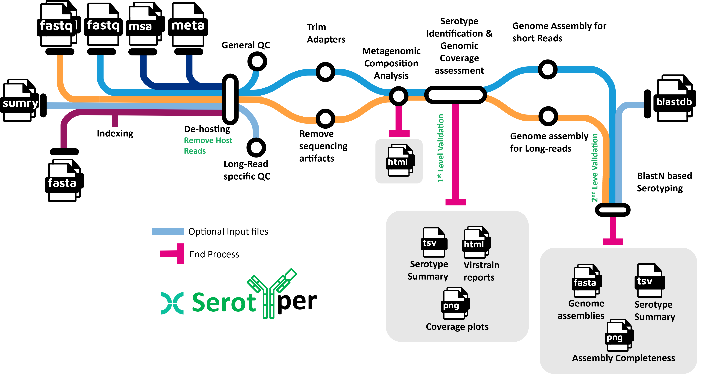

# Pipeline Overview
Pipeline for Viral Serotyping



## Step 0: Installation and indexes procurement

### Conda Installation
To run the pipeline, you must install Miniconda on your system. It is easy to do so by following these steps:

```bash
## Download the shell script from the website: https://docs.anaconda.com/miniconda/

## Provide the executable permission
wget https://repo.anaconda.com/miniconda/Miniconda3-latest-Linux-x86_64.sh
chmod +x Miniconda3-latest-Linux-x86_64.sh

## Install it in the home directory or whichever directory you wish. Press ENTER until prompted to change the installation directory
## then sit back and relax
./Miniconda3-latest-Linux-x86_64.sh

## Once conda is installed, restart the terminal and install mamba for quick dependency installation
conda install -n base -c conda-forge -c bioconda mamba
```
> Note: Skip this step if you already have Conda or Anaconda installed

### Cloning the repository and organizing the data

```bash
## Clone the repository
git clone https://github.com/Rohit-Satyam/serotyper.git

## Install Serotyper dependencies as follows
mamba env create -f environment.yml

## Activate the environment
conda activate serotyper
```

### Download pre-prepared indexes


## Step 1: Indexing Custom genome for dehosting

```
bowtie2-build --threads 20 Bos_taurus.ARS-UCD1.3.dna.toplevel.fa  Bos_taurus.ARS-UCD1.3.dna.toplevel.fa
nextflow run main.nf --input "data/illuminape/SRR27845*_{1,2}.fastq.gz" --skipTrim true --hostile_ext="--index /data/serot
yper/resources/index/Bos_taurus.ARS-UCD1.3.dna.toplevel.fa" -resume
```

## Step 2: Running Serotyper


## To do list:
